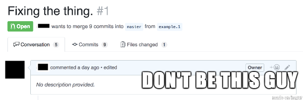

# Effective Pull Requests

This is my baseline for effective pull requests using Git.

> Note that different teams might have established different approaches or conventions. Treat this page as a set of suggestions rather than a set of rules.

## The Basics

A `commit` is a change in the code. Commits are stored in a repository (in our case this is managed by Git). The current state of the code is an aggregation of all known commits.

A `pull request` (also known as `PR`) is a request to review changes in the code. A PR might include multiple commits. There are multiple tools available for managing pull requests:
- Gerrit
- Built-in tools by Git/Gitlab/Bitbucket etc.
- IDEs also have integration for PRs.

There are two groups of people who get involved in a PR:
- The author(s) of the commits in the PR and
- the reviewer(s).

Pull requests have become very popular for a number of reasons. Some of them include:
- They often lead to higher quality of source code. Just think that at least one more pair of eyes will have a look at your code.
- Pull requests help keep a clean(er) and documented log of code evolution.
- Team alignment. Different opinions can be discussed in the context of a PR, helping make a decision before merging. Conventions can also be enforced on PR level using automated tools (linters, code quality checks, test thresholds etc). It's also a great tool for helping newcomers or junior developer get up to speed with what you're working on.

## Creating PRs

### Make it short and sweet. 

- Keep it small in size. This will help reviewers to review changes fater.
- Keep it focused. Try to put only one thing in the PR (i.e. don't mix new linter rules with new features). This helps the reviewer to wrap his mind around the specific challenge the PR is trying to address.
- Keep it clean. Try to have a list of commits that follow your train of thought and implementation. 

### Provide context

When creating the PR, most likely you'll be prompted to provide a title and a description. This is a great opportunity to provide context to the reviewer(s). The title should describe what is the challenge addressed by the current PR. It can also have a prefix with the related JIRA issue or a prefix indicating whether the PR is a feature, bug, hotfix or something else. The description can provide additional context like:
- A description of the challenge being addressed.
- A checklist of items contained in the current PR.
- Any decisions or assumptions. This is usually a great discussion starter.
- Things to pay attention on. This is particularly useful when multiple reviewers are involved, and each one has expertise on a different part of the PR.
- Any questions or follow up items. 

### Assign your audience

Before sharing your PR with reviewers, it's a good idea to first review your own PR!
- Check your code one last time.
- Go over the checklist.
- See if you can remove any noise or simplify things.
- Make sure any automated checks are passing.

Then target your audience:
- People that you need their opinion.
- People that might learn from the PR.
  
  Since there are multiple roles in the audience, it's a good idea to specify who should focus on what.

  ### Merge it
  
  After making sure that everyone has completed the review, the PR should be ready to be merged. Make sure there are no blockers:
  - Merge conflicts.
  - Tests are passing.
  - Quality gates.
  - Other deployments are passing.

Merging is usually the responsibility of the PR's creator. However this might change, depending on release strategy, branching model etc. Make sure the team is aligned on this.

## Reviewing

There's a list of common do's and do not's.

- ✅ Checkout the code locally.
- ✅ Read the PR's title and description.
- ✅ Use the tool for reviews that makes you more productive.
- ✅ Try to run the code and tests.
- ⛔️ Ignore failing checks.
- ✅ React on feedback from checks.
- ✅ Request changes if there are no tests.
- ✅ Provide feedback after tests are fixed.
- ✅ Learn whenever checks fail.

When commenting try to:
- ✅ Be polite.
- ✅ Offer praise.
- ✅ Visit the JIRA ticket or referenced documentation for extra information.
- ✅ Adapt on the style before asking for changes.
- ✅ Add your suggestions.
- ✅ Validate your assumptions and suggestions.
- ✅ Convert large suggestions to a new PR.
- ✅ Resist the urge to comment. Pick your battles wisely!
- ✅ Offer an alternative (Github's [suggestion feature](https://docs.github.com/en/pull-requests/collaborating-with-pull-requests/reviewing-changes-in-pull-requests/incorporating-feedback-in-your-pull-request) is great for that).
- ⛔️ Nitpicking.
- ✅ Take longer discussions to a call/meeting, BUT write result summary.

An extra thing I like to do is try to provide feedback in a positive manner, while remembering that this is feedback towared the code and not the author. Here's a few examples:

- ⛔️ You are missing a variable here.
- ✅ There's a variable missing here: [suggestion].
- ⛔️ I don't like this approach.
