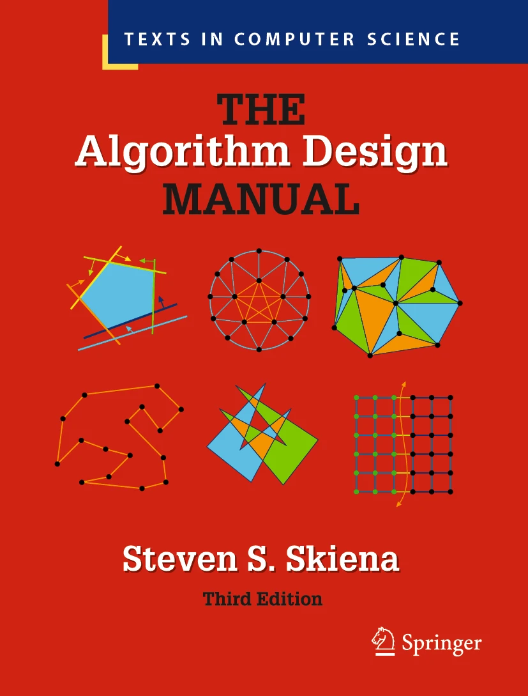

Algorithms and data structures.

## Introduction to Algorithms
Thomas H. Cormen, Charles E. Leiserson, Ronald L. Rivest, and Clifford Stein

{ align=left width="100"} 

This is the book I studied back in the university. Initially known as `CLR` (Stein was not included as an author on first edition). It contains almost everything you need to know when studying either for university or coding tests.

[:material-goodreads:](https://www.goodreads.com/book/show/23463279-designing-data-intensive-applications)
[:material-web:](https://www.goodreads.com/book/show/108986.Introduction_to_Algorithms/) 

## The Algorithm Design Manual
Steven S. Skiena

{ align=left width="100"} 

[:material-goodreads:](https://www.goodreads.com/book/show/425208.The_Algorithm_Design_Manual)
[:material-web:](https://www.algorist.com/)