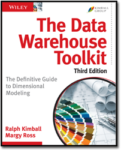
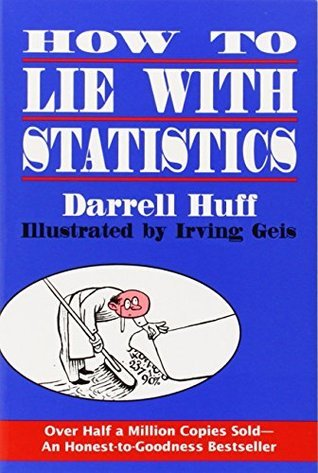

Books related to data and statistics.

## Designing Data Intensive Applications

[:material-goodreads:](https://www.goodreads.com/book/show/23463279-designing-data-intensive-applications)
[:material-web:](https://dataintensive.net/) 

By Martin Kleppmann

{ align=left width="100"}

#### Overview

One of the most well-known books related to data engineering. Each chapter discusses different approaches or decisions of data systems. The topics vary from physical representation of data to challenges of distributed data systems.

#### Why read this book?

Each paragraph is distilled knowledge. It's great both for learning the internals of data systems and as a reference. Highly recommended if you're working with data.

## The Data Warehouse Toolkit

[:material-goodreads:](https://www.goodreads.com/book/show/748203.The_Data_Warehouse_Toolkit)
[:material-web:](https://www.kimballgroup.com/data-warehouse-business-intelligence-resources/books/data-warehouse-dw-toolkit/)

By Ralph Kimball and Margy Ross

{ align=left width="100"}

#### Overview

A "...classic guide to dimensional modeling".  Provides timeless techniques on data modelling, and helps structure your thoughts when making design decisions.

#### Why read this book?

A practical guide to dimensional modeling. This book can help you understand what is a star schema and thge types of fact and dimension tables. It also offer guidelines on designing the dimensional model. Great both for learning and as reference material. However be cautious before applying the learnings, as new technologies and approaches to data modelling have emerged.

## How to Lie with Statistics

[:material-goodreads:](https://www.goodreads.com/book/show/51291.How_to_Lie_with_Statistics) 

By Darrell Huff

{ align=left width="100"} 

#### Overview

Great book describing common statistics errors or missinterpretions to non-statiticians.

#### Why read this book?

Classic book about statistics. The book highlights errors of interpretation of statistics or misuse of concepts that might accidentally (?) misslead. It can help you review statistics in media with a more critical mindset. Examples might feel a bit dated (the book was actually written in 1954).

