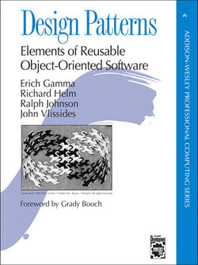
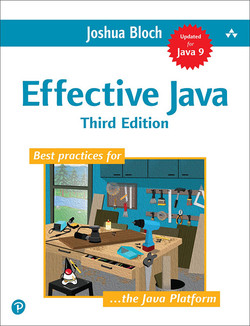
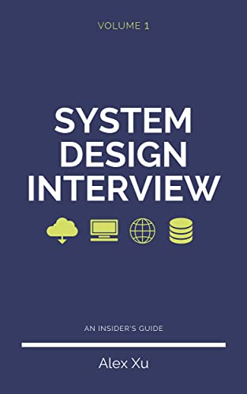

Anything that can help become a more effective developer.

## Design Patterns: Elements of Reusable Object-Oriented Software

[:material-goodreads:](https://www.goodreads.com/book/show/85009.Design_Patterns)

By Erich Gamma, Grady Booch, Richard Helm, Ralph Johnson, John Vlissides

{ align=left width="100"}

#### Overview

Commonly known as Gang of Four (GoF) book. 

#### Why read this book?

Why try to reinvent the wheel?

## Effective Java

[:material-goodreads:](https://www.goodreads.com/book/show/40227500-effective-java)
[:material-web:](https://www.oreilly.com/library/view/effective-java-3rd/9780134686097/) 

By Joshua Bloch

{ align=left width="100"}

#### Overview

One of the few books specific to a programming language that is worth having. The book is full of recipes on how to do things more effectively using the Java programming language.

#### Why read this book?

You want to become better in Java, right?

## System Design Interview – An insider's guide

[:material-goodreads:](https://www.goodreads.com/book/show/54109255-system-design-interview-an-insider-s-guide)
[:material-web:](https://bytebytego.com/) 

By Alex Xu

{ align=left width="100"}

#### Overview

Each chapter presents the design of a different type of software system. The design is presented in a structured way, helping you gain confidence and a methodology for dealing with such tasks both on work environment and during an itnerview.

#### Why read this book?

Great as preparation for system design interviews (does justice to the title). Also great for helping you get a structured approach on designing software systems.